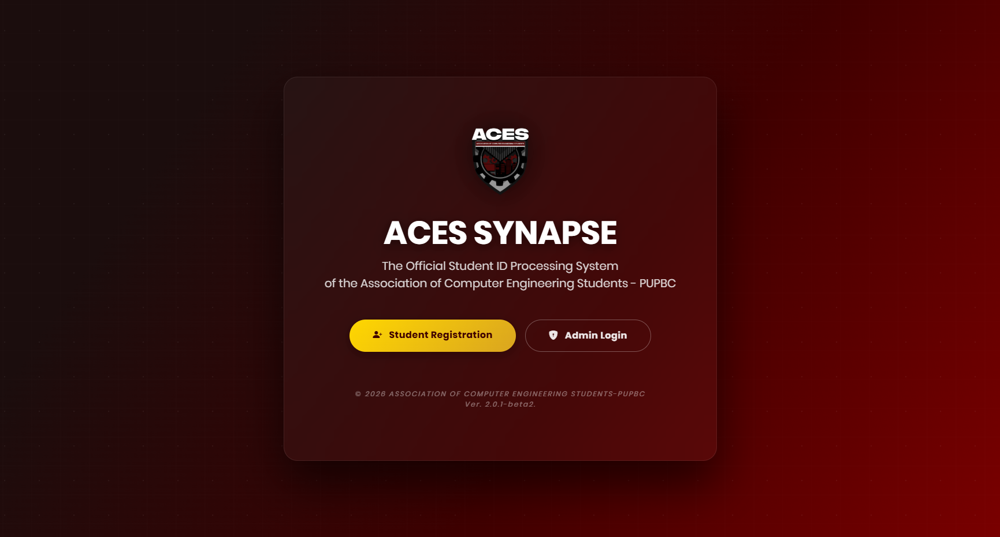
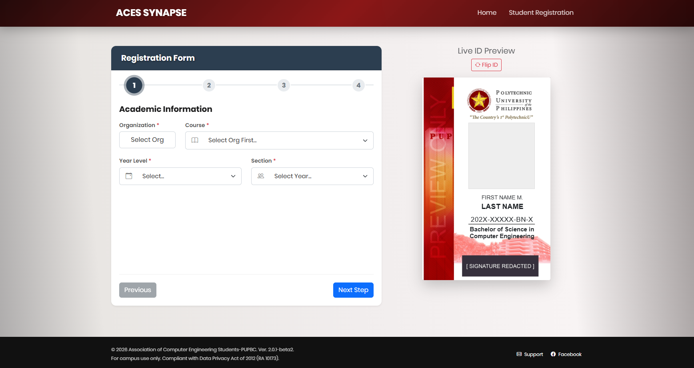
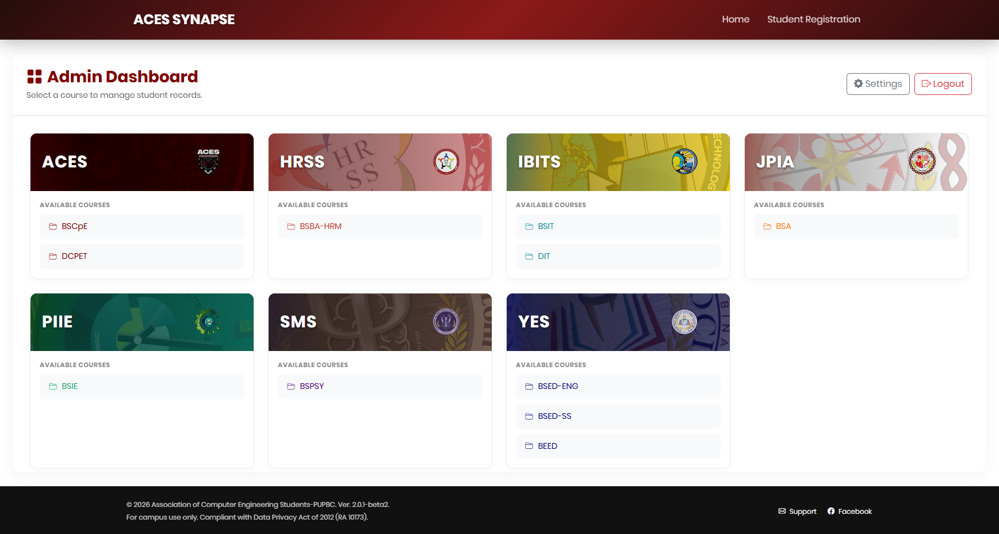

<div align="center">
  
</div>
<div align="center">

# Project Synapse
### Student Data Management & Registration System


**ACES Synapse** is a centralized web platform designed to streamline student registration, data encoding, and membership management for the **Association of Computer Engineering Students (ACES)** and other academic organizations at **PUP Biñan Campus**.

[View Live Demo](https://aces2026synapse.pythonanywhere.com) · [Report Bug](https://github.com/JOBIJEEEB/pupbc_synapse/issues) · [Request Feature](https://github.com/JOBIJEEEB/pupbc_synapse/issues)

</div>

---
## 🛠️ Technical Stack

| Component | Technology | Description |
| :--- | :--- | :--- |
| **Backend** |  | Core web framework handling routes and logic. |
| **Database** |  | Lightweight, serverless relational database. |
| **ORM** |  | Object-Relational Mapper for safe database queries. |
| **Frontend** |   | Custom Bento Grid CSS and jQuery Inputmask. |
| **Hosting** |  | Cloud platform for WSGI deployment. |

---

## 📸 Project Screenshots

| **Student Registration** | **Admin Dashboard** |
|:---:|:---:|
|  |  |
| *Multi-step wizard with live ID preview* | *Bento-grid layout for managing records* |

---

## ✨ Key Features

* **Dynamic Registration Wizard** 📝  
    Replaces manual encoding with a multi-step digital form that validates student data in real-time.
    
* **Live ID Preview** 🪪  
    Automatically generates a visual preview of the student's ID card as they type, ensuring accuracy before submission.

* **Bento-Grid Dashboard** 🍱  
    A modern, responsive admin interface inspired by bento box layouts for efficient record management.

* **Smart Data Export** 📊  
    One-click CSV generation formatted specifically for class and section lists, ready for printing or Excel.

* **Organization Isolation** 🏫  
    Supports multiple organizations (ACES, HRSS, JPIA) with dynamic branding, headers, and color themes.

---

## 📂 Project Structure

```text
pupbc_synapse/
├── app/
│   ├── routes/          # Blueprints (Auth, Admin, Main)
│   ├── static/          # Assets (CSS, JS, Org Logos)
│   ├── templates/       # Jinja2 HTML Templates
│   └── models.py        # Database Schema
├── instance/            # SQLite Database
├── config.py            # App Configuration
├── seed.py              # Data Seeder
└── run.py               # Entry Point
